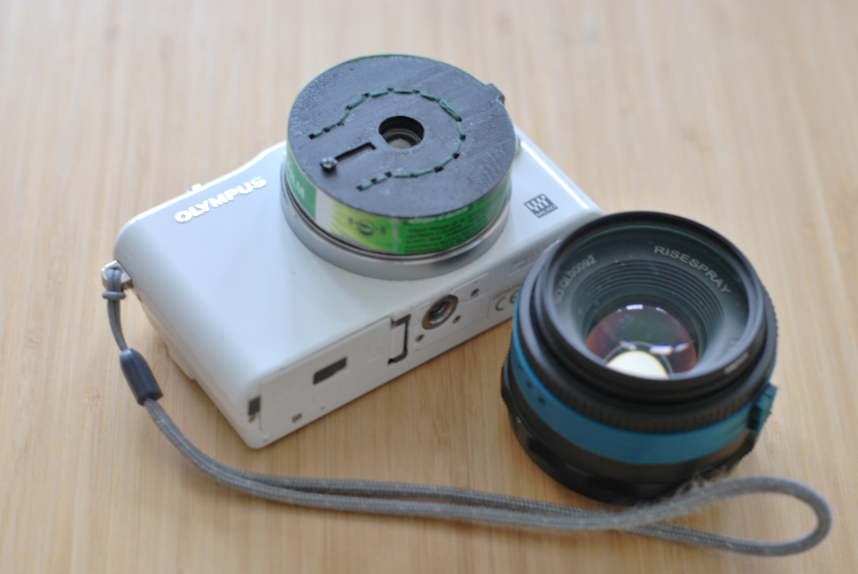
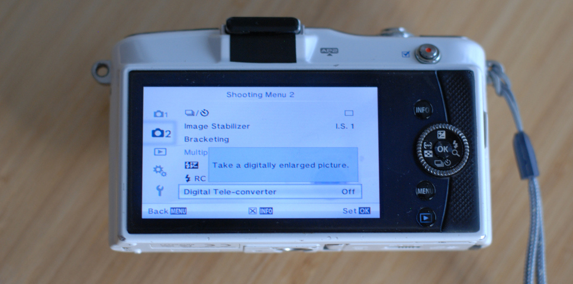
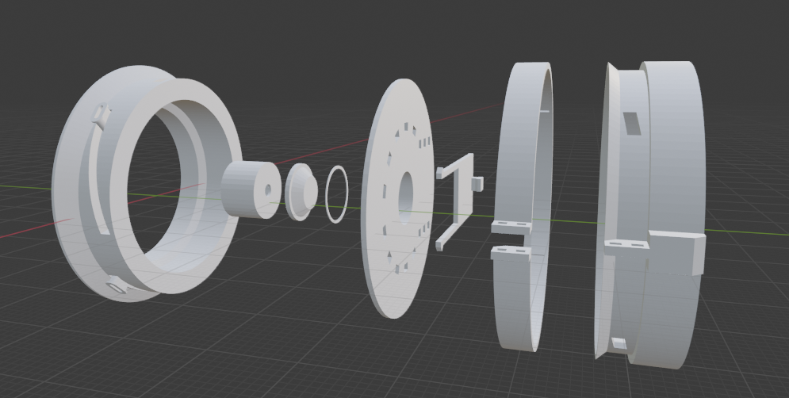
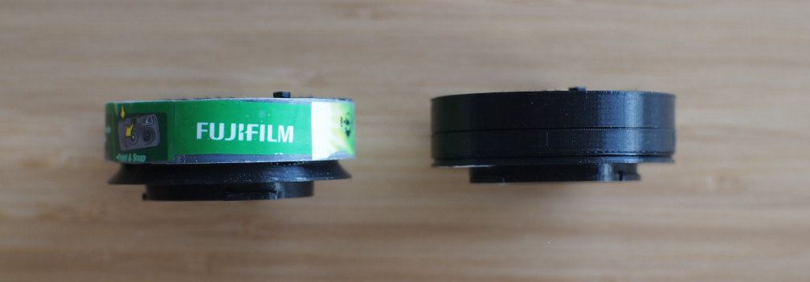
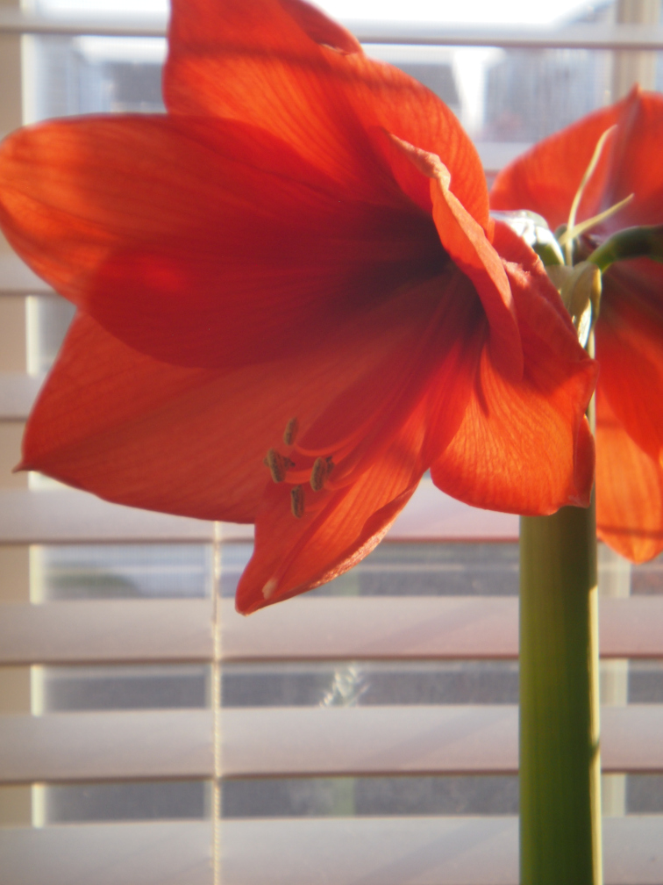
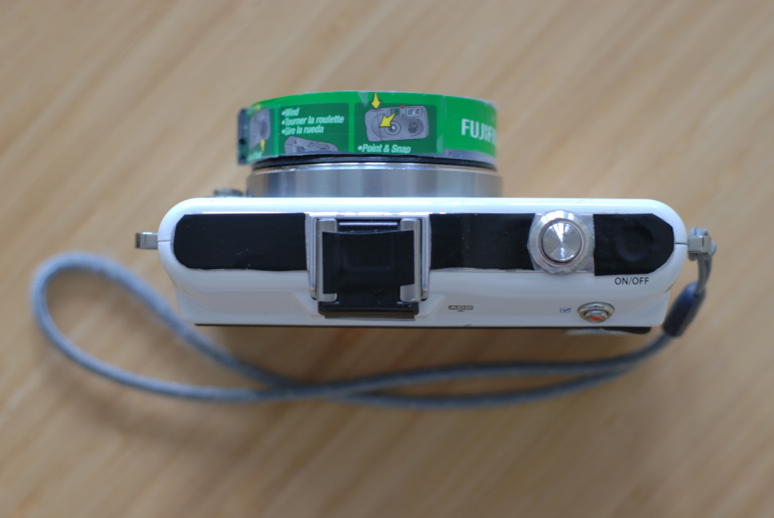
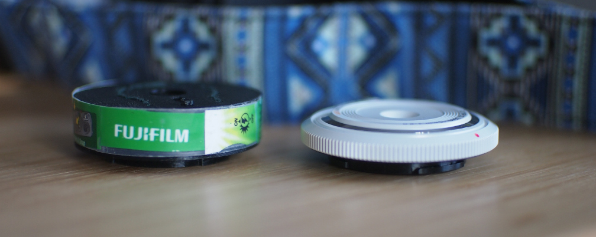

# 30 mm "Body Cap Lens" - Introduction

Let's say you recently bought a 15mm Olympus "Body-Cap Lens" for the fun of a
tiny, lightweight lens that lets you run around in daylight and shoot without
worrying about perfect focus and sharpness.
And you love the thing, because it's tiny and lightweight and worry-free and you
associate it with beautiful weather and leisurely afternoons.

But you *just wish* it was zoomed in about 2x to ~30mm.
Maybe you have a pocket printer, and you want to take pictures of the people you
meet in parks and cities and quickly hand over a physical copy because most
people don't have printed pictures of their friends anymore!

Here's what you do: you go into your camera settings and turn on the digital
teleconverter:

But I wanted to have some more fun, so I decided to adapt the lens from a
single-use camera. Single-use cameras mostly still use 35 mm film,
and come with very cheap, very slow, but very compact lenses in the 30-35 mm
range - they're wayyy smaller than the fast 35 mm glass shown above.

Now I'm not the first person to have this idea, in my research I saw that
George Moua has a very well-designed model for Sony E-mount that uses parts from
a Kodak Funsaver. If you shoot Sony, go check it out:
https://www.georgemoua.com/store/3d-printed-kodak-funsaver-30mm-f10-lens-for-sony-e-mount

More credit where credit's due, I also used `awdemuth`'s "Micro Four Thirds
Pinhole Lens - 11mm FL" as a reference for designing my lens's mount, here on
Thingiverse: https://www.thingiverse.com/thing:2358493

But I wanted to roll my own for a few reasons:
* my camera takes Micro 4/3, not Sony E-mount
* I wanted an integrated lens cover
* my printer frankly isn't very good...
* ...but I also wanted a close-focus mechanism for occasional closeups
* and I just wanted the experience of designing something like this

The folks at Unique Photo in Philadelphia were kind enough to let me take a dive
in their recycling bin, and I turned up a [Fujifilm Quicksnap Flash](https://www.fujifilm.com/us/en/consumer/film-quicksnap/quicksnap/quicksnap-400/specifications).

I went through about 6 design iterations in Blender, some of which included
crazy attempts at focusing mechanisms like spider springs and wedges, before
settling on the version presented here:

The lens is held together using stitches, since I didn't want to require screws
for this project and I wasn't confident my printer could print any other
fastening system well enough.
There's also some black electrical tape on the insides to block out light leaks.

The helicoid itself uses 4 pegs in rails instead of a full screw-and-thread
design. The sides of the pegs are about as smooth as any filament-based printer
can print, so while this design is fiddly to assemble, it doesn't need as much
sanding work as a full screw-and-thread.

Here's the helicoid extended for close focus (on the left) and closed down for
far-focus (on the right).

The helicoid allows for focus within about 30 centimeters or one foot, and it's
pretty forgiving since the aperture is somewhere in the `f8-f10` range.
For reference, these are enormous Amaryllis flowers, so the whole cluster was
about the size of a person's head:

Fully closed, the helicoid works well enough for "typical" single-use camera
distances of a couple meters out to infinity, although it's not exactly sharp
even at full resolution:

The resulting lens measures about 15 mm from tip to mount, which I think isn't
bad at all for a homemade lens with an integrated lens cover. Micro 4/3 has a
flange focal distance of 19.25 mm, and Fujifilm officially lists the Quicksnap
Flash's lens as 32 mm, so there's only about
`(15mm + 19.25 mm) - 32 mm = 2.25 mm` of "extra" (comprising the lens cover and
some space for flare-reduction) beyond the theoretical smallest size possible
for a 32 mm lens.

Of course, Olympus's own 15mm BCL-1580 only sticks out 9 mm from the mount,
making it almost truly pocketable, and you'd probably get better sharpness just
cropping its 15 mm output to 30 mm.

Which was why I elected to assemble _my_ "body cap lens" using green stitching
and why I wrapped it in the plastic peel from the donor camera.
If it's going to be a toy, it might as well look the part :)

Other sections:
* [Full-res samples (zip)](images/fullResSamples.zip)
* [Printing and Assembly](PRINTING_AND_ASSEMBLY.md)
* [Other Lenses](OTHER_LENSES.md)
* [Scripts](SCRIPTS.md)
