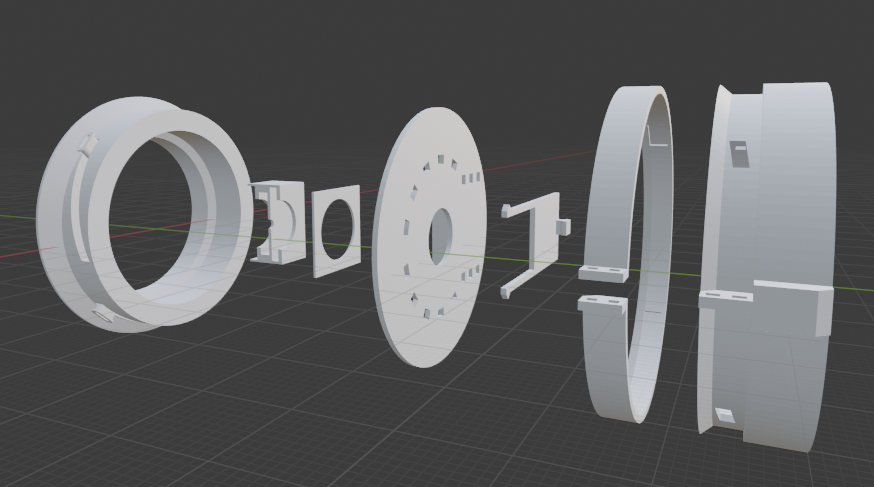
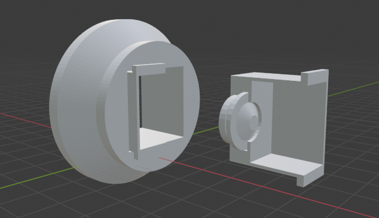

# 30 mm "Body Cap Lens" - Other Lenses

While familiarizing myself with different single-use cameras, I found a review
comparison on thedarkroom.com:
https://thedarkroom.com/disposable-cameras-top-cameras-reviewed-compared/

This comparison suggests the Kodak Funsaver is actually a bit sharper than
"the rest of the pack." I also found out Kodak used to make a "Max HQ"
camera that used an "Ektanar" branded two-element lens:
https://www.flickr.com/photos/captkodak/271885573

Now the point of this project was to ignore specs and try my best to make
something fun-to-use. But my inner spec-junkie is hard to ignore, and I just
*had* to get my hands on one of those "Ektanar" lenses.

This is the black-thread-on-black-plastic lens in the [Intro](INTRO.md) photos.
It's slightly larger, and I had to source the camera itself from ebay, since
they don't seem to be manufactured anymore and probably won't show up in a lab.
It also seems a bit wider than the Quicksnap Flash's "official" 32mm.
My copy's lenses still seem to be plastic instead of glass.

You can judge if the effort was worthwhile, the
[Full-res samples (zip)](images/fullResSamples.zip) contains samples from that
lens. Here's a pair if you don't want to download them all:

| Quicksnap | Max HQ |
|---|---|
|||

To my eye, sharpness is more consistent across the frame for landscapes with the
Max HQ lens. I'll probably use the Max HQ more, but it feels like pursuing it
went against the spirit of the project a little - why obsess over having the
sharpest toy lens possible if it's still a toy lens? And using black stitches
for a "more sophisticated" look was definitely a missed opportunity...

The blender file and stls for this lens are in the [`blender`](blender) and
[`stls`](stls) directories in this project repository. The assembly process
is very similar to the Fujifilm Quicksnap version, but the lens-and-aperture
assembly is modeled as half of a pair, so make sure to print two of them.

The STLs are also available on Thingiverse here: https://www.thingiverse.com/thing:4874844

## Tips for "adapting" other lenses

The Max HQ's focal length was a mystery, so I designed a "test bench" for
finding its far-focus distance:

The blender file and stls for this are in the [`blender`](blender) and
[`stls`](stls) directories in this project repository.

I'm glad at least that the Max HQ helped me design this test bench, which may
even be helpful for 3d printing adapters for other lenses to Micro 4/3.
It might also help if you have something other than a Quicksnap Flash or Max HQ
on-hand and want to just adapt that instead of digging through recycling bins
or going to the trouble of buying something on the internet.

Other sections:
* [Intro](INTRO.md)
* [Full-res samples (zip)](images/fullResSamples.zip)
* [Printing and Assembly](PRINTING_AND_ASSEMBLY.md)
* [Scripts](SCRIPTS.md)
