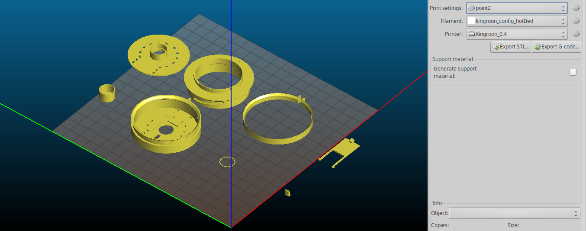
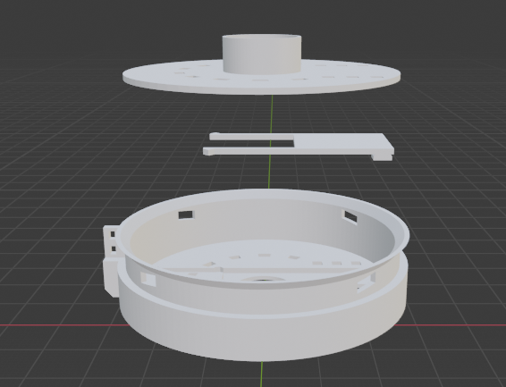
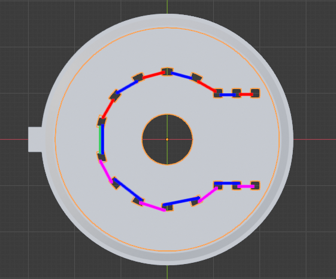
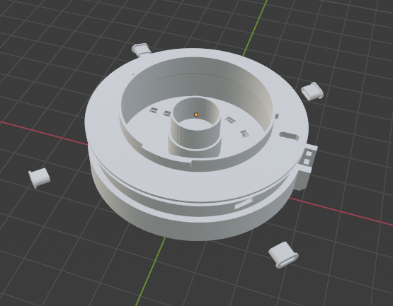
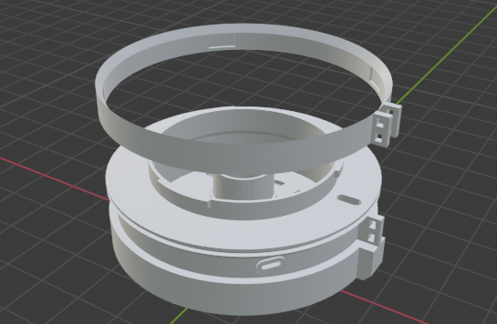
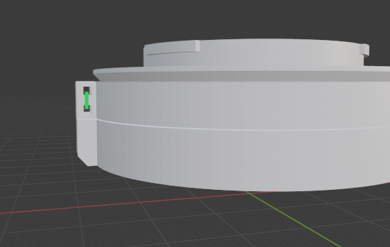

# 30 mm "Body Cap Lens" - Printing and Assembly

STLs are available on Thingiverse here: https://www.thingiverse.com/thing:4874839
They're also in a zip here: [stls/Quicksnap_stls.zip](stls/Quicksnap_stls.zip).

There's also a Blender file here: [blender/Fujifilm_Quicksnap_lens.blend.zip](Fujifilm_Quicksnap_lens.blend.zip)

I wish I could say the Blender file only exists to help understand the assembled
lens, but it's actually where all the parts were modeled xD.

Also, **disclaimer**: since this project involves disassembling high-voltage
electronics, 3d printing, needles-and-thread, and your (potentially expensive)
camera body - I cannot assume responsibility for any mishaps you may suffer as a
result of this project. Please be smart and be safe and be careful!

## Materials and Tools
* access to a 3d printer, preferably with black filament. I just used standard PLA, not PLA+.
* some sandpaper or even a nail file
* needle and thread - your choice of color!
* scissors suitable for cutting thread in tight areas
* opaque black tape, electrical works well
* the camera that you want to mount this puppy to
* one `Fujifilm Quicksnap Flash` single-use camera, or emptied camera shell

Camera shops with film labs may have these, I had great luck at Unique Photo
in Philadelphia. Even pharmacy photo centers like at Walgreens and CVS only send
the film to their labs - if you ask nicely and get lucky with timing, they might
have some emptied shells they can give you.

Or you could just enjoy a single-use camera until it's empty, then ask the photo
center or photo lab if you can keep the camera body. You can also extract the
film yourself (it should be rolled up already when you're done) and only hand
that part over.

## Printing Tips

All STLs are oriented to print without supports:

My printer's bed is a bit curved though, so I had to print most of these
components one-by-one and centered instead of all at once.
I used a heated bed and regular PLA filament, but no rafts.

A few slicing tips:
* I recommend 0.2 mm layer height
* there isn't much infill, so any pattern or percentage should be fine.
* be careful when orienting the lens cover - if the "grain" of the print opposes
the direction that it's supposed to slide in, it might get stuck too easily.
* make sure to print 4 of the thread pegs
* you may also want to print several of the padding rings for recessing the lens

I still had to sand out the insides of my helicoid "tracks" a little bit, but
I didn't even have to break out real sandpaper, the file from a pair of nail
clippers was sufficient. I filed each track until a peg felt like it could move
freely along the track.

You may also need to clean up the holes that the pegs slot into on the front
shell component.

**Finally**, this is a component that will be mounted to your camera, so after
printing the components and doing any cleanup, make sure to wash and dry the
parts to avoid plastic dust getting in your camera.

## Assembly

**Step 0** - **carefully** extract the lens from your Quicksnap Flash single-use
camera. I don't have pictures from this process, but here's a guide online:
http://roaldfre.blogspot.com/2011/09/taking-apart-disposable-camera.html

I've also put a pdf backup copy in this project's `pdfs` folder.

_**Emphasis on carefully**_ - the Quicksnap Flash's eponymous "flash" is backed
by a high-voltage capacitor that can deliver a painful shock if you touch the
circuit board.

The capacitor may still have lingering charge even if the camera's flash was
fired before it was processed, and even if it sat unused for a while.
The author of that post recommends fully discharging the capacitor with a
resistor, but I didn't have one on hand, so I did the disassembly outdoors and,
when the time came, I used a pair of takeout chopsticks (DON'T USE BARE-METAL
TWEEZERS) to touch some aluminum foil across the capacitor's leads.
There was an audible spark and a bit of foil got vaporized :O

**Step 1** - Sandwich the lens cover between the lens's front shell and the lens
holder plate. Make sure the tab on the lens cover goes through the slot in the
front shell. Make sure the little armies are sitting flat in their tracks.

**Step 2** - Using a needle and thread, run stitches through the holes in the
sandwiched front shell and lens holder plate. I recommend:
1. starting with a loop of thread in the center, where marked in green
2. running stitches to one end of the horshoe "over" along the red marks and "under" in between
3. stitching back to the other side of the horshoe, under-and-over along the blue marks
4. reversing direction again and running over-and-under along the purple marks
back to the center, making a few more loops along green, and tying off

Apologies for my poor sewing terminology. Make sure to pull the thread tight
with each stitch. Backstitching a few times may also help reduce slack.

Once the stitches are complete, use bits of black tape to plug any light leaks
in the front shell assembly. Or don't! Maybe that'll be fun too!

**Step 3** - Use the lens assembly and aperture cylinder to press the lens from
the Quicksnap flash and any padding rings into the lens holder plate. You may
need to tape the assembly in place.

Attach the mount to your camera and hold the front shell assembly in place, and
use your camera to check if far-away objects are sufficiently in-focus.
If not, try to add or remove padding rings.

The number of rings you need may vary depending on the quality of your print,
since this can vary how thick the lens holder plate is. I tried to model the
lens holder plate so the lens would usually be a little too far forward for
infinity focus, so you should only have to pad backwards from the front of the
lens.

Focus adjustments will be difficult to make beyond this step, so take your time
here. When you're happy with the lens's far-focus setting, securely tape the
lens assembly and aperture cylinder in place.

**Step 4** - Place the mount inside the front shell assembly, and rotate until
the holes in the front shell assembly are lined up with the beginning of the
helicoid tracks. Insert a peg into each of the four holes.

I found this easier to do with the lens assembly sitting on a tabletop.
It might also be helpful to have an extra set of hands on deck, or to use a bit
of tape to keep each installed peg from falling out immediately.

**Step 5** - Slip the peg ring around the slot on the front shell assembly.
It should be flexible enough to bend a bit, and there should be small gaps
between its "fins" and the fin on the front shell assembly.

Take care not to lose any pegs while attaching the peg ring.
Also make sure that the beveled side of the ring matches the bevel of the slot
in the front shell assembly.

**Step 6** - Using your needle and thread, put several loops of thread through
the holes on the "fin," as shown in green.
Make sure to pull the thread tight with each pass.

**Step 7** - Give the front assembly a couple twists to test out the helicoid,
and slide the lens cover open and closed a few times. These mechanisms may stick
a bit when freshly assembled, but should wear down to comfortable levels over
time. If you're feeling cute, apply a decorative wrapper to the lens barrel.

Other sections:
* [Intro](INTRO.md)
* [Full-res samples (zip)](images/fullResSamples.zip)
* [Other Lenses](OTHER_LENSES.md)
* [Scripts](SCRIPTS.md)
