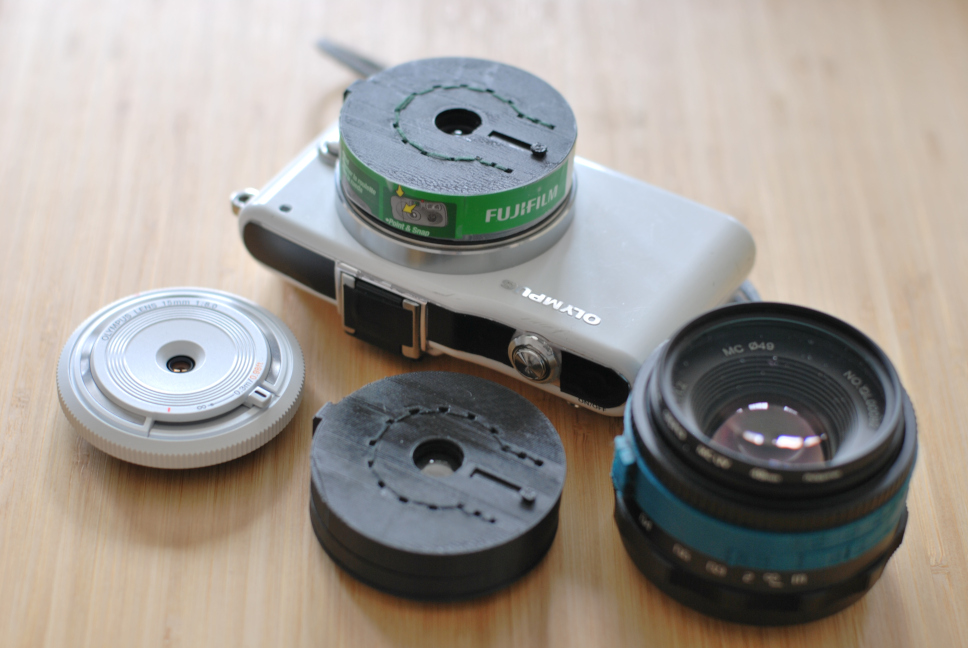

# 30 mm Body Cap Lens

Files and assembly instructions for a ~30 mm body-cap-style lens for Micro 4/3.
Uses 3D printed components and the lens from a Fujifilm Quicksnap Flash
single-use camera.

Also includes an alternate design using the lenses from a Kodak Max HQ camera
and some notes on how to adapt to other lenses.

Contents:
* [Intro](INTRO.md)
* [Full-res samples (zip)](images/fullResSamples.zip)
* [Printing and Assembly](PRINTING_AND_ASSEMBLY.md)
* [Other Lenses](OTHER_LENSES.md)
* [Scripts](SCRIPTS.md)
