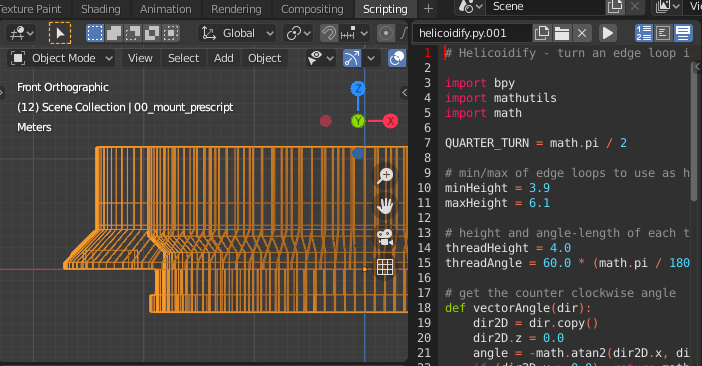

# 30 mm "Body Cap Lens" - Scripts

I mentioned in the [Printing and Assembly](PRINTING_AND_ASSEMBLY.md) section
that all parts throughout this project were modeled in Blender.

I feel like I owe an explanation, even if this is "casual 3d printing."
I was looking to get a little more familiar with Blender, with the hope of
eventually using it to model things closer to what it's designed for.
Of course, there was also the added bonus that Blender works great across
many platforms, can run on pretty wimpy computers, and is both
"free-as-in-free-lunch" and "free-as-in-open-source."

I wrote two scripts in this project to help model the helicoid tracks and square
some circles:

* [helicoidify.py](scripts/helicoidify.py)
* [rectanglify.py](scripts/rectanglify.py)

*Before helicoidify...*

*...after helicoidify!*

These scripts operate on a selected object and can be run using the `Scripting`
tab in Blender. They're designed to operate on vertices that have had object
scale, rotation, and translation baked into their coordinates using the
`Apply Object Transform` operator (accessible using the F3 search menu in the
`Layout` panel). There are hardcoded values at the top of each script to specify
the range of vertex coordinates to operate on.

It can be hard to apply other operations after running the scripts, although
they can be undone using Blender's undo/redo system. I always copied the mesh
I was applying scripts to before running them.

Other sections:
* [Intro](INTRO.md)
* [Printing and Assembly](PRINTING_AND_ASSEMBLY.md)
* [Full-res samples (zip)](images/fullResSamples.zip)
* [Other Lenses](OTHER_LENSES.md)
